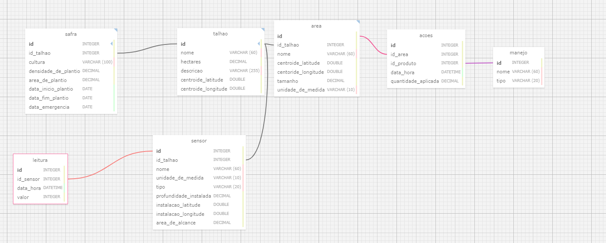

# Projeto de banco de dados para registro de manejos de insumos e leituras de sensores

## Descrição
Este projeto visa a criação de um sistema de banco de dados completo para gerenciar e registrar informações sobre os manejos de insumos e as leituras realizadas por sensores em áreas específicas dentro dos talhões. O sistema permitirá o monitoramento preciso e eficiente das condições do solo e outros parâmetros vitais para otimizar as práticas agrícolas.

#Aquivos contidos
- .xml: Arquivo XML criado a partir do SQL Desing, contendo os dados estruturados para auxiliar nas configurações.
- .sql: Arquivo SQL contém o script de criações e definições das tabelas do banco de dados.
- .png: Arquivo contendo uma imagem do Diagrama Entidade-Relacionamento (DER) do projeto, que visualiza as tabelas, suas relações e as principais propriedades dos dados.

# Diagrama Entidade-Relacionamento (DER)

# Modelo Entidade-Relacionamento (MER) - Textual 
## Entidades e Atributos

### 1. Área
- **id** (INTEGER) - Identificador único da área (chave primária), ele é autoincremental.
- **id_talhao** (INTEGER) - Chave estrangeira que referencia o talhão.
- **nome** (VARCHAR(60)) - Nome dado a aréa pelo usuário para facilitar a identificação.
- **centroide_latitude** (DOUBLE) - Latitude do centro da área.
- **centroide_longitude** (DOUBLE) - Longitude do centro da área.
- **tamanho** (DECIMAL) - Tamanho da área cadastrada
- **unidade_de_medida** (VARCHAR(10)) - Informa se o tamanho está cadastrado em metros quadrados ou hectares.

### 2. Sensor
- **id** (INTEGER) - Identificador único do sensor (chave primária), ele é autoincremental.
- **id_talhao** (INTEGER) - Chave estrangeira que referencia a tabela Área.
- **nome** (VARCHAR(60)) - Nome criado para usuário para facilitar a identificação do sensor.
- **unidade_de_medida** (VARCHAR(10)) - Unidade de medida usada pelo sensor, cada tipo de sensor tem uma unidade padrão.
- **tipo** (VARCHAR(20)) - Diz o tipo do sensor. Sensor de PH, sensor de umidade, sensor de potássio, sensor de fósforo.
- **profundidade_instalada** (DECIMAL) - Profundidade em que o sensor foi instalado.
- **instalacao_latitude** (DOUBLE) - Latitude da instalação do sensor.
- **instalacao_longitude** (DOUBLE) - Longitude da instalação do sensor.
- **area_de_alcance** (DECIMAL) - Área que o sensor consegue cobrir.

### 3. Leitura
- **id** (INTEGER) - Identificador único da leitura (chave primária), ele é autoincremental.
- **id_sensor** (INTEGER) - Chave Estrangeira que referencia a tabela Sensor.
- **data_hora** (DATETIME) - Data e hora da leitura.
- **valor** (INTEGER) - Valor registrado pela leitura.

### 4. Talhão
- **id** (INTEGER) - Identificador único do talhão (chave primária), ele é autoincremental.
- **nome** (VARCHAR(60)) - Nome do talhão.
- **hectares** (DECIMAL) - Tamanho do talhão em hectares quadrados.
- **descricao** (VARCHAR(255)) - Descrição do talhão.
- **centroide_latitude** (DOUBLE) - Latitude do centro do talhão.
- **centroide_longitude** (DOUBLE) - Longitude do centro do talhão.

### 5. Safra
- **id** (INTEGER) - Identificador único da safra (chave primária), ele é autoincremental.
- **id_talhao** (INTEGER) - Chave estrangeira que referencia o talhão.
- **cultura** (VARCHAR(100)) - Tipo de cultura plantada.
- **densidade_de_plantio** (DECIMAL) -  Número de plantas por hectare. 
- **area_de_plantio** (DECIMAL) - Área plantada com a cultura.
- **data_inicio_plantio** (DATE) - Data de início do plantio.
- **data_fim_plantio** (DATE) - Data de fim do plantio.
- **data_emergencia** (DATE) - Data de emergência da cultura.

### 6. Ações
- **id** (INTEGER) - Identificador único da ação (chave primária), ele é autoincremental.
- **id_area** (INTEGER) - Chave estrangeira que referencia a tabela Área.
- **id_produto** (INTEGER) - Chave estrangeira que referencia a tabela Produto.
- **data_hora** (DATETIME) - Data e hora da ação.
- **quantidade_aplicada** (DECIMAL) - Quantidade do produto aplicada.

### 7. Manejo
- **id** (INTEGER) - Identificador único do produto (chave primária).
- **nome** (VARCHAR(60)) - Nome do produto utilizado no manejo (ex: água, fertilizante específico, produto de correção).
- **tipo** (VARCHAR(20)) - Informa o tipo do produto, irrigação, aplicação de fertilizantes, correção de solo.

## Tabela de Cardinalidade

| Relacionamento          | Entidade 1 |  Entidade 2  | Mínimo | Máximo |
|-------------------------|------------|--------------|--------|--------|
| Talhão ↔ Sensor         | Talhão     | Sensor       | 1:0    | 1:N    |
| Sensor ↔ Leitura        | Sensor     | Leitura      | 1:0    | 1:N    |
| Talhão ↔ Safra          | Talhão     | Safra        | 1:0    | 1:N    |
| Talhão ↔ Área           | Talhão     | Área         | 1:0    | 1:N    |
| Área ↔ Ações            | Área       | Ação         | 1:0    | N:N    |
| Produto ↔ Ações         | Produto    | Ação         | 1:0    | 1:N    |

## Explicação das Cardinalidades
Talhao ↔ Sensor: Um talhão pode não ter sensores ou ter muitos sensores. Um sensor só pode existir se estiver associado a um talhão.

Sensor ↔ Leitura: Um sensor pode não ter nenhuma leitura ou pode ter muitas. Uma leitura não pode existir sem estar associada a um sensor e só pode ter um sensor. 

Talhão ↔ Safra: Um talhão pode não ter nenhuma ou ter muitas safras. Uma safra só pode existir se estiver associada a um talhão e só pode estar associada a um.

Talhão ↔ Área: Um talhão pode não ter nenhuma area ou ter muitas áreas, enquanto uma área deve ter talhão. 

Área ↔ Ações: Uma área pode não possuir nenhuma ação ou ter muitas  ações, enquanto uma ação pode acontecer em uma área ou em muitas áreas.

Produto ↔ Ações: Um produto deve estar associado pode não ter ações ou ter muitas  alções, enquanto uma ação só pede ter um produto (1).
